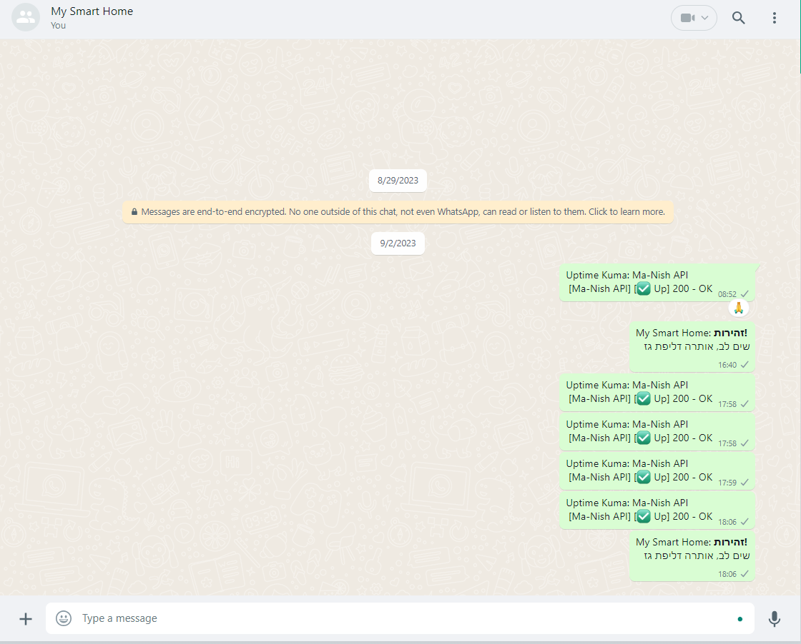
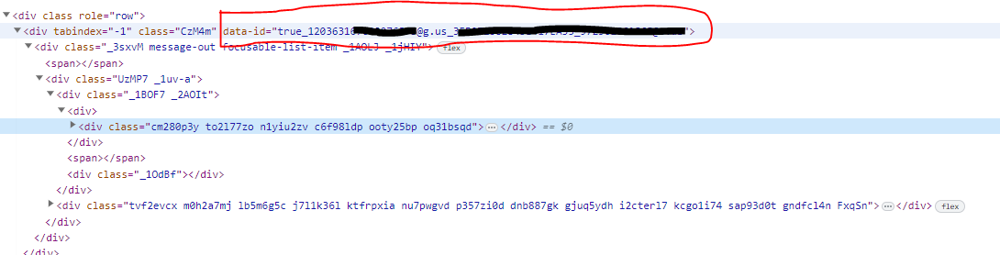

# matterbridge-custom-notifier

[matterbridge](https://github.com/42wim/matterbridge) is a bridge between mattermost, IRC, gitter, xmpp, slack, discord, telegram, rocketchat, twitch, ssh-chat, zulip, whatsapp, keybase, matrix, microsoft teams, nextcloud, mumble, vk and more with REST API (mattermost not required!) written in GO.

[matterbridge-custom-notifier](https://github.com/t0mer/matterbridge-custom-notifier) is a [Homeassistant ](https://www.home-assistant.io/) custom notification component that enables us to send notification to Whatsapp groups using the Matterbridge gateway and without the need to register to 3rd party integrator or the official Whatsapp cloud API.

## Limitations
* When using your own number to send the notifications it will act like your are sending messages to yourself. that way no alert will popup. Consider using other phone number for that.

## Getting started

### Get whatsapp group id (JID) from whatsapp web
You will also need to fid the jid (Group identifier) of the group you want to send the notifications to. You can get the JID from whatsapp web.

Open whatsapp web and navigate to the relevant group:

Open Developer tools, click the inspect toll and click on one of the messages:

In the data-id you will see string that looks like that: **true_1203631xxxxxxxxx@g.us_3EB072082B43E417EA35_xxxxxxxxxxxx@c.us**.
Copy the part that start right after **true_** and ends with **@g.us**. this is the JID you will need.

### Setting up matterbridge
First, You will need to install and configure [Matterbridge](https://github.com/42wim/matterbridge#installing--upgrading).
You can also download pre-compiled binaries from here:
* [Linux ARM](https://matter.techblog.co.il/linux_arm/matterbridge)
* [Linux ARM64](https://matter.techblog.co.il/linux_arm64/matterbridge)
* [Linux x86_x64](https://matter.techblog.co.il/linux_amd_x86_x64/matterbridge)

Now, create a new firectory named matterbridge under /opt and copy the binary file to this directory.

