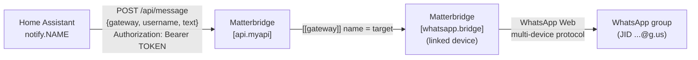

# matterbridge-custom-notifier

A [Home Assistant](https://www.home-assistant.io/) custom notification platform that sends messages to **WhatsApp groups** through a self-hosted [Matterbridge](https://github.com/42wim/matterbridge) instance. There is no need to register with a third-party integrator or to use the official WhatsApp Cloud API: Home Assistant posts the message to the Matterbridge REST API, and Matterbridge relays it to WhatsApp through a linked device.

[Matterbridge](https://github.com/42wim/matterbridge) is an open-source chat bridge written in Go. It connects Mattermost, IRC, Gitter, XMPP, Slack, Discord, Telegram, Rocket.Chat, Twitch, ssh-chat, Zulip, WhatsApp, Keybase, Matrix, Microsoft Teams, Nextcloud, Mumble, VK and more, and it exposes a REST API.

> [!IMPORTANT]
> Matterbridge's WhatsApp multi-device bridge uses **whatsmeow**, an unofficial implementation of the WhatsApp Web multi-device protocol. It is not supported by WhatsApp, it may stop working when WhatsApp changes its protocol, and automated use of a WhatsApp account may conflict with WhatsApp's Terms of Service. Use it at your own risk, preferably with a dedicated number.
>
> This project is not affiliated with, endorsed by, or sponsored by WhatsApp, Meta, the Matterbridge project, or Home Assistant / Nabu Casa.

## Table of contents

- [Features](#features)
- [How it works](#how-it-works)
- [Requirements](#requirements)
- [Limitations](#limitations)
- [Getting started](#getting-started)
  - [Get the WhatsApp group ID (JID)](#get-the-whatsapp-group-id-jid)
  - [Set up Matterbridge](#set-up-matterbridge)
  - [Run Matterbridge as a systemd service](#run-matterbridge-as-a-systemd-service)
- [Installation](#installation)
  - [HACS (custom repository)](#hacs-custom-repository)
  - [Manual installation](#manual-installation)
- [Configuration](#configuration)
- [Usage](#usage)
- [Troubleshooting](#troubleshooting)
- [Security notes](#security-notes)
- [Known issues](#known-issues)
- [Notes](#notes)
- [Contributing](#contributing)
- [License](#license)

## Features

- Legacy `notify` platform (`platform: matterbridge`) configured in `configuration.yaml`.
- Sends each notification as a `POST` request to the Matterbridge API (`/api/message`).
- The notification `target` selects the Matterbridge **gateway**, so one notifier can reach several WhatsApp groups (one gateway per group).
- The title is rendered in bold (`*title*`, WhatsApp formatting) above the message.
- Optional bearer-token authentication for the Matterbridge API.
- Configurable sender nickname, shown in the message through Matterbridge's `RemoteNickFormat`.

## How it works


```mermaid
flowchart LR
    HA["Home Assistant<br/>notify.NAME"] -- "POST /api/message<br/>{gateway, username, text}<br/>Authorization: Bearer TOKEN" --> API["Matterbridge<br/>[api.myapi]"]
    API -- "[[gateway]] name = target" --> WA["Matterbridge<br/>[whatsapp.bridge]<br/>(linked device)"]
    WA -- "WhatsApp Web<br/>multi-device protocol" --> G["WhatsApp group<br/>(JID ...@g.us)"]
```

1. You call the `notify.<name>` action with a `title`, a `message` and a `target`.
2. The integration sends this JSON body to the configured `url`:

   ```json
   {
     "text": "*<title>* \n<message>",
     "gateway": "<first target>",
     "username": "<nickname>"
   }
   ```

   If a `token` is configured, the request also carries the header `Authorization: Bearer <token>`.
3. Matterbridge receives the message on its API account and routes it through the `[[gateway]]` whose `name` matches `gateway`.
4. The WhatsApp account of that gateway posts the message to the group JID configured as its `channel`.

## Requirements

- Home Assistant with [HACS](https://hacs.xyz/) (or manual access to the `custom_components` folder).
- A Matterbridge binary **built with WhatsApp multi-device support** (build tag `whatsappmulti`). Upstream does not publish such binaries because of licensing; see [Set up Matterbridge](#set-up-matterbridge).
- A WhatsApp account to link to Matterbridge as a linked device. A separate, dedicated number is recommended (see [Limitations](#limitations)).
- Network access from Home Assistant to the Matterbridge API (default port `4242` in the example below).
- The JID of each WhatsApp group you want to notify.

## Limitations

- If you link your own number, notifications appear as messages you sent yourself, so your phone does not raise an alert. Consider using another phone number for the bridge.
- Only the **first** `target` is used per call. To notify several groups, call the action once per gateway.
- `title` and `target` are both required. See [Troubleshooting](#troubleshooting).

## Getting started

### Get the WhatsApp group ID (JID)

You need the JID (group identifier) of the group you want to send notifications to. You can get it from WhatsApp Web.

Open WhatsApp Web and navigate to the relevant group:


Open the browser developer tools, click the inspect tool, and click one of the messages:


The `data-id` attribute contains a string that looks like this: **`true_120363XXXXXXXXXXXX@g.us_XXXXXXXXXXXXXXXXXXXX_XXXXXXXXXXXX@c.us`**.
Copy the part that starts right after **`true_`** and ends with **`@g.us`**. This is the JID you need.

Alternatively, set the WhatsApp `channel` to an empty string (or any non-JID value); the bridge logs the JID and name of every group it has joined, then refuses to start that gateway.

### Set up Matterbridge

First, create a new directory named `matterbridge` under `/opt` and download a pre-compiled Matterbridge binary with multi-device WhatsApp support:

* [Linux ARM](https://matter.techblog.co.il/linux_arm/matterbridge)
* [Linux ARM64](https://matter.techblog.co.il/linux_arm64/matterbridge)
* [Linux x86_64](https://matter.techblog.co.il/linux_amd_x86_x64/matterbridge)

Alternatively, compile Matterbridge for your OS and CPU architecture. Multi-device WhatsApp support needs the `whatsappmulti` build tag; see [Building with whatsapp (beta) multidevice support](https://github.com/42wim/matterbridge#building-with-whatsapp-beta-multidevice-support) in the Matterbridge README. For example:

```bash
go install -tags whatsappmulti github.com/42wim/matterbridge@master
sudo mkdir -p /opt/matterbridge
sudo cp "$(go env GOPATH)/bin/matterbridge" /opt/matterbridge/
```

`go install` places the binary in `$(go env GOPATH)/bin`; the second and third commands copy it to `/opt/matterbridge`.

Next, create a file named `matterbridge.toml` in the same directory as the binary, and add the following:

```toml
[general]
LogFile="/var/log/matterbridge.log" # Path to the log file
IconURL="https://github.com/identicons/{NICK}.png" # Create an avatar from GitHub if the user does not have one
PreserveThreading=true
ShowUserTyping=false
ShowJoinPart=false
NoSendJoinPart=false

[api.myapi]
BindAddress="0.0.0.0:4242" # API bind address and port
Buffer=1000
RemoteNickFormat="{NICK} "
Token="<your-api-token>" # Optional: protect the API endpoint with a strong token

[whatsapp.bridge]
# Number you will use as a relay bot. Tip: get a disposable SIM card; don't rely on your own number.
Number="+<country-code><phone-number>"
# The first time you log in you need to scan a QR code; the session is then saved to disk.
# The multi-device bridge always persists the session in an SQLite database named "<SessionFile>.db",
# relative to the working directory. If SessionFile is unset, the file is a hidden ".db" in the working directory.
SessionFile="session-<phone-number>.gob"
# If your terminal has a white background, invert the QR code so it can be scanned properly.
# The multi-device bridge ignores this option.
QrOnWhiteTerminal=false
# Other WhatsApp contacts see messages as coming from the bridge; the original nick is part of the message.
#RemoteNickFormat="@{NICK}: "
RemoteNickFormat="{NICK}: "
# Extra label that can be used in RemoteNickFormat
# Optional (default empty)
Label="Organization"


[[gateway]]
name="gateway1" # Use this name as the notification "target"
enable=true

    [[gateway.out]] # Outgoing: send messages to this WhatsApp group
    account="whatsapp.bridge"
    channel="<group-jid>@g.us"


    [[gateway.in]] # Incoming: receive messages from the API
    account="api.myapi"
    channel="api"

```

To send to more than one group, add one `[[gateway]]` block per group, each with its own `name` and WhatsApp `channel`, and the same API account as `gateway.in`.

Now run Matterbridge (if you get a permission error, run `chmod +x matterbridge` to make it executable):

```bash
cd /opt/matterbridge
./matterbridge -conf /opt/matterbridge/matterbridge.toml
```

If everything goes well, you should see a QR code. In the WhatsApp app, open **Linked devices** and scan it:


After a successful scan, the bridge appears in the linked devices list as **whatsmeow**, the library Matterbridge's multi-device bridge is based on.


### Run Matterbridge as a systemd service

For now, this multi-device build of Matterbridge is installed as a system service.

To add Matterbridge as a system service, create the unit file:

```bash
sudo nano /etc/systemd/system/matterbridge.service
```

and paste the following:

```ini
[Unit]
Description=Matterbridge daemon
After=network-online.target

[Service]
WorkingDirectory=/opt/matterbridge
Type=simple
User=root
ExecStart=/opt/matterbridge/matterbridge -conf /opt/matterbridge/matterbridge.toml
Restart=always
RestartSec=5s

[Install]
WantedBy=multi-user.target

```

Save the file, then enable and start the service:

```bash
sudo systemctl daemon-reload
sudo systemctl enable --now matterbridge
```

To verify that the service is running:

```bash
systemctl status matterbridge
```

The output should look like this:

```
● matterbridge.service - Matterbridge daemon
   Loaded: loaded (/etc/systemd/system/matterbridge.service; enabled; vendor preset: enabled)
   Active: active (running) since Tue 2023-09-05 10:24:12 UTC; 6 days ago
 Main PID: 9486 (matterbridge)
    Tasks: 6 (limit: 4915)
   CGroup: /system.slice/matterbridge.service
           └─9486 /opt/matterbridge/matterbridge -conf /opt/matterbridge/matterbridge.toml

Sep 11 16:51:02 host matterbridge[9486]: 16:51:02.534 [Client WARN] Error decrypting message from <phone-number>@s.whatsapp.net in <group-jid>@g.us: failed to decrypt group message: no send
```

You can also follow the log:

```bash
tail -f /var/log/matterbridge.log
```

## Installation

### HACS (custom repository)

To add the repository to HACS, open Home Assistant and navigate to HACS:


Then click **Integrations**:


In the upper-right corner, click the three dots and select **Custom repositories**:


Under **Repository**, paste the following address: **https://github.com/t0mer/matterbridge-custom-notifier**

Under **Category**, select **Integration**:


Then click **ADD**.

The repository now appears in the custom repositories list as **matterbridge whatsapp custom notification / notify**:


You can now download the integration from HACS. Restart Home Assistant after the download.

> Newer HACS versions have a different layout (no separate **Integrations** page, and the category field is labelled **Type**; choose **Integration**), but the **Custom repositories** entry is still in the three-dot menu.

### Manual installation

1. Copy the `custom_components/matterbridge` folder from this repository into the `custom_components` folder of your Home Assistant configuration directory (the result is `<config>/custom_components/matterbridge/`).
2. Restart Home Assistant.

## Configuration

This is a YAML-only notify platform (there is no UI config flow). After installing the integration and restarting Home Assistant, add the following to `configuration.yaml`:

```yaml
notify:
  - platform: matterbridge
    name: matter_whatsapp           # Friendly name; creates the notify.matter_whatsapp action
    nickname: Home Assistant        # Sender name that appears in the message
    url: http://<matterbridge-host>:4242/api/message
    token: !secret matterbridge_token   # The Token from [api.myapi] in matterbridge.toml
```

| Key | Required | Default | Description |
|-----|----------|---------|-------------|
| `platform` | Yes | – | Must be `matterbridge`. |
| `name` | No | `matterbridge` | Standard Home Assistant notify option. The action is exposed as `notify.<name>` (slugified); if omitted, it is `notify.matterbridge`. |
| `url` | Yes | – | Full URL of the Matterbridge API message endpoint. It must end with `/api/message`, for example `http://192.168.1.10:4242/api/message`. |
| `nickname` | Yes | – | Sent as `username`. Matterbridge inserts it through `RemoteNickFormat` (`{NICK}`), so with the example above messages start with `<nickname>: `. |
| `token` | No | none | Matterbridge API token. When set, the request carries `Authorization: Bearer <token>`. Must match `Token` in the `[api.*]` section. |

Keep the token in `secrets.yaml` rather than in `configuration.yaml`. Save the file and restart Home Assistant.

## Usage

### Action data

| Field | Required | Description |
|-------|----------|-------------|
| `message` | Yes | Message body. |
| `title` | Yes | Shown in bold above the message. The integration fails if it is missing. |
| `target` | Yes | Name of the Matterbridge `[[gateway]]` to send through. If you pass a list, only the first entry is used. |

### Send a test notification

In Home Assistant, go to **Developer tools** → **Actions** (called **Services** in older versions), select your `notify.<name>` action, switch to YAML mode and enter:

```yaml
action: notify.matter_whatsapp
data:
  title: Test
  message: Hello from Home Assistant
  target: gateway1
```

Then click **Perform action** (**Call service** in older versions). On older Home Assistant versions, use `service:` instead of `action:`.

### Automation example

```yaml
automation:
  - alias: "Gas leak alert to WhatsApp"
    triggers:
      - trigger: state
        entity_id: binary_sensor.gas_leak
        to: "on"
    actions:
      - action: notify.matter_whatsapp
        data:
          title: Warning!
          message: Gas leak detected in the kitchen.
          target: gateway1
```

## Troubleshooting

- **Nothing arrives and the log shows `Error sending notification using matterbridge: ...`**: the HTTP request failed or Matterbridge returned an error status. Check that `url` is reachable from Home Assistant and ends with `/api/message`, and that `token` matches the Matterbridge `Token` (a wrong or missing token returns an authorization error).
- **The action fails with a `TypeError`**: `title` or `target` is missing from the action data. Both are required.
- **The request succeeds but nothing appears in WhatsApp**: `target` must exactly match a `[[gateway]]` `name`, and the gateway must contain the API account as `gateway.in` and the WhatsApp account with the correct group JID as `gateway.out`. Check `/var/log/matterbridge.log`.
- **`Message sent` appears in the log although delivery failed**: the integration logs `Message sent` before it checks the response status, so rely on the error line, not on this one.
- **You must scan the QR code again after every restart**: the session database (`<SessionFile>.db`) is resolved relative to Matterbridge's working directory. Make sure that directory is writable, that Matterbridge always starts from the same directory (for example `WorkingDirectory=/opt/matterbridge` in the systemd unit), and that the `.db` file has not been deleted.
- **No alert on your phone**: the bridge is linked to your own number, so the messages count as sent by you. See [Limitations](#limitations).
- **The integration is not found after installation**: restart Home Assistant after installing it, and check that the folder is `custom_components/matterbridge`.

## Security notes

- **API token**: set a strong `Token` in the Matterbridge `[api.*]` section and store it in Home Assistant's `secrets.yaml`. Without a token, anyone who can reach the API can post to your WhatsApp groups.
- **Keep the Matterbridge API off the internet**: the API speaks plain HTTP. Bind it to a trusted interface (for example `127.0.0.1` or a LAN address instead of `0.0.0.0`), firewall the port, and never forward it from your router. Use a VPN or a TLS reverse proxy if you need remote access.
- **The linked WhatsApp session is full account access**: the session file created by Matterbridge gives full access to the linked WhatsApp account. Protect the Matterbridge directory, don't commit or share the session file, and unlink the device from **Linked devices** in WhatsApp if the host is compromised.
- **Screenshots and logs** can reveal phone numbers and group JIDs; redact them before sharing.

## Known issues

- Matterbridge's WhatsApp multi-device support is marked **beta** upstream and depends on an unofficial protocol implementation, so WhatsApp changes can break it.
- Upstream Matterbridge does not ship pre-built binaries with multi-device WhatsApp support; you need to build one or use the binaries linked above.
- The HTTP request has no timeout, so an unreachable Matterbridge host can delay the action call.

## Notes

- Matterbridge is not officially supported by WhatsApp. It is an open-source project written in Go.
- You can add many gateways to the Matterbridge configuration to send notifications to different groups. This is why the gateway name is passed as the `target`.

## Contributing

Issues and pull requests are welcome on the [issue tracker](https://github.com/t0mer/matterbridge-custom-notifier/issues). Please don't include real phone numbers, group JIDs, tokens or session files in issues or screenshots.

## License

This project is licensed under the [GNU General Public License v3.0](LICENSE).
